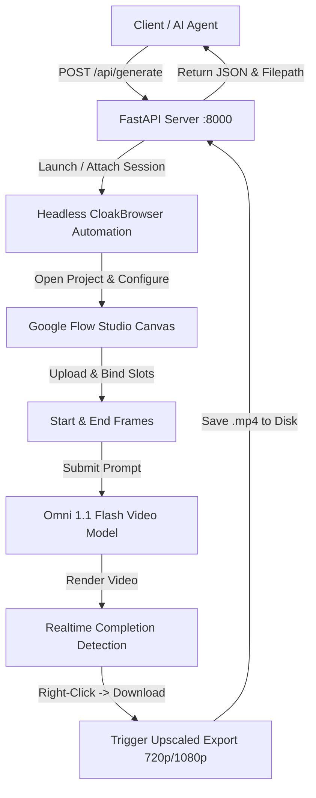

# ✦ Google Flow API Wrapper (Omni 1.1 Flash)

[](https://www.python.org/downloads/)
[](https://fastapi.tiangolo.com)
[](https://playwright.dev/)
[](https://opensource.org/licenses/MIT)

A free, self-hosted, local **REST API wrapper** for **Google Flow Studio** (`https://labs.google/fx/tools/flow`) powered by headless browser automation.

Turn your Google Flow AI Video Studio account into a local API endpoint on `localhost:8000` with support for text-to-video, reference image inputs, **first-to-last keyframe interpolation (Start & End frames)**, and **automatic resolution upscaling** (`360p` &rarr; `720p`, `720p` &rarr; `1080p`).

---

## ✦ Features

- **◈ Free & Self-Hosted**: No proxy subscription fees. Uses your existing Google AI / Flow account credits directly.
- **◈ Local Privacy & Security**: Your session cookies and generated videos never leave your local machine (`127.0.0.1:8000`).
- **◈ Start & End Frame Keyframing**: Interpolate smooth transitions between two reference images with unique asset hashing and automatic slot binding.
- **◈ Automatic Resolution Upscaling**: Automatically detects source resolution and triggers Google Flow's native upscaling export (`360p` &rarr; `720p Upscaled`, `720p` &rarr; `1080p Upscaled`).
- **◈ Headless & Maximized Automation**: Supports both invisible background rendering (`headless=True`) and visible execution (`headless=False`).
- **◈ AI Agent Native**: Includes interactive Swagger UI docs (`/docs`) and a pre-packaged agent skill (`omni-flash-SKILL.md`) for drop-in use with Cursor, Antigravity, AutoGen, and LangChain.

---

## ⬡ Architecture



---

## ⚡ Quick Start

### 1. Prerequisites
- Python 3.10 or newer
- Google Chrome installed

### 2. Installation
Clone the repository and install dependencies:

```bash
git clone https://github.com/leopardbyte/google-flow-api-wrapper.git
cd google-flow-api-wrapper
pip install -r requirements.txt
playwright install chromium
```

### 3. Sync Your Authenticated Session

#### Option A: 1-Click Tampermonkey Sync (Recommended)
Bypasses Google BotGuard anti-automation challenges entirely by exporting directly from your daily browser:
1. Install the included **[`google_flow_session_sync.user.js`](google_flow_session_sync.user.js)** in Tampermonkey (Chrome / Brave / Edge).
2. Start the local server: `python main.py` -> `[1] Start Custom Local API Server`.
3. Open **[Google Flow](https://labs.google/fx/tools/flow)** while logged in and click **"⚡ Sync to Local Server (:8000)"** in the bottom-right widget.

#### Option B: Browser Capture Fallback
Run the interactive CLI:
```bash
python main.py
```
Select **`[4] Capture New Session`** to manually log in within a spawned browser session.

### 4. Start the Local API Server
```bash
python main.py
```
Select **`[1] Start Custom Local API Server`** (or run `uvicorn app:app --port 8000`).
- **REST API Base URL**: `http://127.0.0.1:8000`
- **Interactive Swagger Docs**: `http://127.0.0.1:8000/docs`

---

## ◈ API Reference

### `POST /api/generate`

Generate a video using JSON parameters.

#### Request Body Schema

```json
{
  "prompt": "Cinematic commercial product shot of a laptop opening up",
  "mode": "frames",
  "start_frame_path": "C:\\path\\to\\start_frame.jpg",
  "end_frame_path": "C:\\path\\to\\end_frame.jpg",
  "aspect_ratio": "16:9",
  "resolution": "720p",
  "duration_sec": 10,
  "count": 1,
  "headless": true
}
```

| Parameter | Type | Default | Description |
| :--- | :--- | :--- | :--- |
| `prompt` | `string` | **Required** | The creative text prompt directing the camera motion or action. |
| `mode` | `string` | `"frames"` | Studio sub-tab: `"frames"` (Start/End slots) or `"ingredients"`. |
| `start_frame_path` | `string` | `null` | Absolute path to the Start Frame image. |
| `end_frame_path` | `string` | `null` | Absolute path to the End Frame image. |
| `aspect_ratio` | `string` | `"16:9"` | Aspect ratio: `"16:9"` (landscape) or `"9:16"` (portrait). |
| `resolution` | `string` | `"360p"` | Base generation resolution: `"360p"` or `"720p"`. |
| `duration_sec` | `integer` | `6` | Video duration in seconds: `4`, `6`, `8`, or `10`. |
| `count` | `integer` | `1` | Batch generation count: `1`, `2`, `3`, or `4`. |
| `headless` | `boolean` | `true` | Run browser invisibly in the background. |

#### Response Schema

```json
{
  "status": "COMPLETED",
  "saved_file": "C:\\path\\to\\google-flow-api-wrapper\\video_ui_1788038618.mp4",
  "prompt": "Cinematic commercial product shot...",
  "mode": "Frames",
  "resolution": "720p",
  "duration_sec": 10,
  "aspect_ratio": "16:9"
}
```

---

## ⌨ Code Examples

### PowerShell (One-Liner)

```powershell
Invoke-RestMethod -Uri "http://127.0.0.1:8000/api/generate" -Method Post -ContentType "application/json" -Body (@{
    prompt = "Cinematic camera sweep as the laptop opens, Liquid Retina display illuminates with vibrant color"
    mode = "frames"
    start_frame_path = "C:\Users\username\Pictures\start.jpg"
    end_frame_path = "C:\Users\username\Pictures\end.jpg"
    aspect_ratio = "16:9"
    resolution = "720p"
    duration_sec = 10
    count = 1
    headless = $true
} | ConvertTo-Json)
```

### Python (`requests`)

```python
import requests

payload = {
    "prompt": "Dramatic sunset timelapse over a calm ocean with rolling waves",
    "aspect_ratio": "16:9",
    "resolution": "360p",
    "duration_sec": 6,
    "count": 1,
    "headless": True
}

res = requests.post("http://127.0.0.1:8000/api/generate", json=payload)
data = res.json()

print(f"Status: {data['status']}")
print(f"Saved Video: {data['saved_file']}")
```

### cURL

```bash
curl -X POST "http://127.0.0.1:8000/api/generate" \
  -H "Content-Type: application/json" \
  -d '{
    "prompt": "A sleek sports car driving through a neon city at night",
    "aspect_ratio": "16:9",
    "resolution": "360p",
    "duration_sec": 6,
    "headless": true
  }'
```

---

## ⚠ Disclaimer & Fragility Notice

> **Note on Maintenance & Independent Scope**:
> - **Independent Project**: This is an independent, unofficial open-source automation tool created for personal research and workflow prototyping. It is not affiliated with, maintained by, or endorsed by Google or Google Labs.
> - **DOM Fragility**: Because Google Flow does not provide a public developer API, this wrapper drives the web interface via browser automation (Playwright). If Google makes major structural updates, redesigns modal elements, or alters class names on the Google Flow Studio canvas, automation locators may require updating.

---

## ⚖ License

This project is licensed under the [MIT License](LICENSE).
