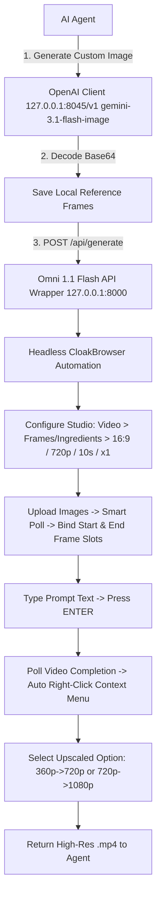

# Google Flow (Omni 1.1 Flash) AI Agent Skill

This skill provides an unofficial, local REST API wrapper for **Google Flow AI Video Studio** (`https://labs.google/fx/tools/flow`). It allows AI agents to trigger text-to-video and image-to-video generations locally without third-party SaaS fees, CAPTCHAs, or credit proxy costs.

---

## Quick Overview

- **Local Base URL**: `http://127.0.0.1:8000`
- **Interactive OpenAPI Specs**: `http://127.0.0.1:8000/docs`
- **Model Engine**: `Omni 1.1 Flash` via Headless CloakBrowser DOM Automator (`headless=True`, `humanize=False`).
- **Supported Controls**:
  - **Resolution**: `360p` (fast / 5 credits) or `720p`
  - **Duration**: `4s`, `6s`, `8s`, `10s`
  - **Aspect Ratio**: `16:9` (landscape) or `9:16` (portrait)
  - **Batch Count**: `1` (`x1`), `2` (`x2`), `3` (`x3`), `4` (`x4`)
- **Image Generation Partner**: Local OpenAI-compatible Endpoint (`http://127.0.0.1:8045/v1`) using `gemini-3.1-flash-image`.

---

## API Endpoints Summary

| Method | Endpoint | Description |
| :--- | :--- | :--- |
| **GET** | `/` | Health check and server metadata. |
| **GET** | `/api/credits` | Check live Google account credit balance and tier. |
| **GET** | `/api/projects` | List recent Google Flow project spaces. |
| **POST** | `/api/create-project` | Create a new Google Flow studio project space. |
| **POST** | `/api/generate` | Generate video via JSON payload (supports prompt, aspect ratio, resolution, duration, count, image path/base64, headless mode). |
| **POST** | `/api/generate-with-image` | Generate video via HTTP Multipart Form (direct file upload). |
| **POST** | `/api/check-status` | Check status of generation tasks. |

---

## Main Endpoint: `POST /api/generate`

### JSON Request Schema

```json
{
  "prompt": "string (Required)",
  "mode": "frames | ingredients (Default: frames)",
  "start_frame_path": "string or null (Absolute path to start frame image)",
  "start_frame_base64": "string or null (Base64 encoded start frame)",
  "end_frame_path": "string or null (Absolute path to end frame image)",
  "end_frame_base64": "string or null (Base64 encoded end frame)",
  "image_path": "string or null (Generic reference image path)",
  "image_base64": "string or null (Generic reference image base64)",
  "aspect_ratio": "16:9 | 9:16 (Default: 16:9)",
  "resolution": "360p | 720p (Default: 360p)",
  "duration_sec": "4 | 6 | 8 | 10 (Default: 6)",
  "count": "1 | 2 | 3 | 4 (Default: 1)",
  "model_name": "Omni 1.1 Flash (Default)",
  "headless": "boolean (Default: true)",
  "max_wait": "integer (Default: 360)"
}
```

---

## Code Examples for AI Agents

### 1. Text-to-Video Generation

```python
import requests

payload = {
    "prompt": "a cinematic drone shot of a futuristic neon city at night",
    "aspect_ratio": "16:9",
    "resolution": "360p",
    "duration_sec": 6,
    "count": 1,
    "headless": True
}

response = requests.post("http://127.0.0.1:8000/api/generate", json=payload)
result = response.json()

print("Status:", result.get("status"))
print("Saved Video File:", result.get("saved_file"))
```

### 2. First-to-Last Frame Interpolation (Start & End Frames)

```python
import requests

payload = {
    "prompt": "smooth cinematic camera transition connecting the two frames",
    "mode": "frames",
    "start_frame_path": r"C:\Users\jonat\Pictures\scene_start.png",
    "end_frame_path": r"C:\Users\jonat\Pictures\scene_end.png",
    "aspect_ratio": "16:9",
    "resolution": "360p",
    "duration_sec": 8,
    "count": 1,
    "headless": True
}

response = requests.post("http://127.0.0.1:8000/api/generate", json=payload)
result = response.json()

print("Status:", result.get("status"))
print("Saved Video File:", result.get("saved_file"))
```

### 3. Single Image-to-Video Generation

```python
import requests

payload = {
    "prompt": "animate the water and add glowing particle effects",
    "start_frame_path": r"C:\Users\jonat\Pictures\landscape_reference.png",
    "aspect_ratio": "16:9",
    "resolution": "360p",
    "duration_sec": 6,
    "count": 1,
    "headless": True
}

response = requests.post("http://127.0.0.1:8000/api/generate", json=payload)
print(response.json())
```

---

### 3. End-to-End Image Generation + Video Animation Pipeline (Image-to-Video)

This pipeline combines custom image generation (`gemini-3.1-flash-image` via local OpenAI client) with the Omni API Wrapper to generate and animate custom 3D Vox/artistic scenes:

```python
import os
import re
import base64
import requests
from openai import OpenAI

# Step 1: Connect to local Image API Endpoint (127.0.0.1:8045)
client = OpenAI(
    base_url="http://127.0.0.1:8045/v1",
    api_key="your-api-key-here"
)

# Step 2: Generate custom Vox-style image
image_response = client.chat.completions.create(
    model="gemini-3.1-flash-image",
    extra_body={"size": "1280x720"},
    messages=[{
        "role": "user",
        "content": "A 3D Vox news style isometric scene of a futuristic cyber city, 16:9"
    }]
)

# Step 3: Extract base64 payload and save to local PNG file
content = image_response.choices[0].message.content
b64_match = re.search(r"data:image/[^;]+;base64,([A-Za-z0-9+/=\s]+)", content)
b64_str = b64_match.group(1).replace("\n", "").replace(" ", "") if b64_match else content.strip()

ref_image_path = os.path.abspath("vox_reference.png")
with open(ref_image_path, "wb") as f:
    f.write(base64.b64decode(b64_str))

# Step 4: Send generated image to Omni API Wrapper (127.0.0.1:8000) for video animation
payload = {
    "prompt": "Animate this Vox style 3D scene with camera panning and floating voxel particles",
    "image_path": ref_image_path,
    "aspect_ratio": "16:9",
    "resolution": "360p",
    "duration_sec": 6,
    "count": 1,
    "headless": True
}

video_response = requests.post("http://127.0.0.1:8000/api/generate", json=payload)
result = video_response.json()

print("Saved Video File:", result.get("saved_file"))
```

---

### 4. PowerShell Examples

#### First-to-Last Frame Interpolation (Start & End Frames, 720p -> 1080p Upscaled):
```powershell
Invoke-RestMethod -Uri "http://127.0.0.1:8000/api/generate" -Method Post -ContentType "application/json" -Body (@{
    prompt = "Cinematic commercial product shot, smooth fluid motion of the MacBook Pro opening up as the Liquid Retina display and backlit keyboard illuminate with vibrant color, camera glides across the desk"
    mode = "frames"
    start_frame_path = "C:\Users\jonat\antigravity\sharp-mendel\macbook_showcase_start.jpg"
    end_frame_path = "C:\Users\jonat\antigravity\sharp-mendel\macbook_showcase_end.jpg"
    aspect_ratio = "16:9"
    resolution = "720p"
    duration_sec = 10
    count = 1
    headless = $true
} | ConvertTo-Json)
```

#### Fast 360p Text-to-Video Generation (Auto-upscaled to 720p):
```powershell
Invoke-RestMethod -Uri "http://127.0.0.1:8000/api/generate" -Method Post -ContentType "application/json" -Body (@{
    prompt = "A sleek supercar driving through a neon cyber city at night, rain reflections on asphalt"
    aspect_ratio = "16:9"
    resolution = "360p"
    duration_sec = 6
    count = 1
    headless = $true
} | ConvertTo-Json)
```

---

### 5. cURL Command

```bash
curl -X POST "http://127.0.0.1:8000/api/generate" \
  -H "Content-Type: application/json" \
  -d '{
    "prompt": "animate the ocean waves at sunset",
    "image_path": "C:\\Users\\jonat\\Pictures\\landscape.png",
    "aspect_ratio": "16:9",
    "resolution": "360p",
    "duration_sec": 6,
    "count": 1,
    "headless": true
  }'
```

---

## Architecture Flow



---

## API Response Format

```json
{
  "status": "COMPLETED",
  "saved_file": "C:\\Users\\jonat\\antigravity\\sharp-mendel\\google-flow-api-wrapper\\video_ui_1788038618.mp4",
  "prompt": "Cinematic commercial product shot, smooth fluid motion...",
  "mode": "Frames",
  "resolution": "720p",
  "duration_sec": 10,
  "aspect_ratio": "16:9"
}
```


